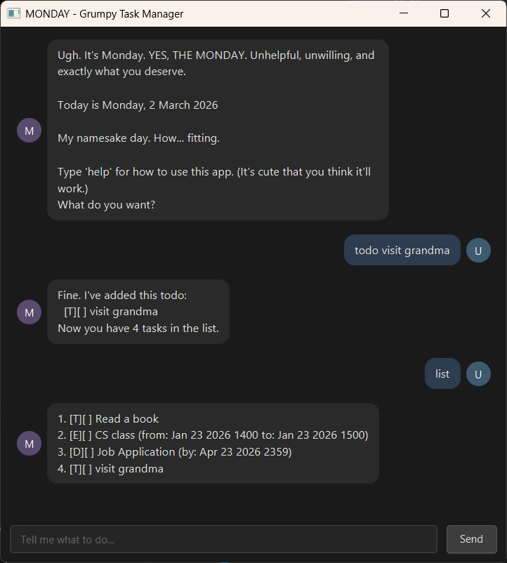

# MONDAY User Guide

MONDAY is a grumpy but efficient task manager for power users who prefer keyboard commands
over mouse clicks. Named after everyone's least favourite day of the week, MONDAY gets the
job done — just don't expect it to be happy about it.

> If you can type fast, MONDAY can manage your tasks faster than any GUI app. Probably.



---

## Table of Contents

- [Quick Start](#quick-start)
- [Features](#features)
  - [Notes about command format](#notes-about-command-format)
  - [Viewing help : `help`](#viewing-help--help)
  - [Adding a todo task : `todo`](#adding-a-todo-task--todo)
  - [Adding a deadline : `deadline`](#adding-a-deadline--deadline)
  - [Adding an event : `event`](#adding-an-event--event)
  - [Listing all tasks : `list`](#listing-all-tasks--list)
  - [Marking a task as done : `mark`](#marking-a-task-as-done--mark)
  - [Marking a task as not done : `unmark`](#marking-a-task-as-not-done--unmark)
  - [Deleting a task : `delete`](#deleting-a-task--delete)
  - [Finding tasks by keyword : `find`](#finding-tasks-by-keyword--find)
  - [Viewing tasks for a date : `view`](#viewing-tasks-for-a-date--view)
  - [Getting a motivational quote : `cheer`](#getting-a-motivational-quote--cheer)
  - [Viewing reminders : `remind`](#viewing-reminders--remind)
  - [Exiting the application : `bye`](#exiting-the-application--bye)
  - [Saving the data](#saving-the-data)
- [FAQ](#faq)
- [Command Summary](#command-summary)

---

## Quick Start

1. Ensure you have **Java 21** installed on your computer.
2. Download the latest `monday.jar` from the [Releases page](https://github.com/petershanxin/ip/releases).
3. Copy the file to the folder you want to use as the home folder for MONDAY.
4. Open a terminal, `cd` into that folder, and run:
   ```
   java -jar monday.jar
   ```
5. A GUI window (or CLI prompt) will appear. Type a command and press **Enter** to execute it.

   Some example commands to try:
   - `list` — lists all your tasks
   - `todo read book` — adds a simple task
   - `deadline submit report /by 2026-03-10 2359` — adds a deadline
   - `find book` — finds all tasks containing "book"
   - `bye` — exits the app

6. Refer to the [Features](#features) section below for details on every command.

---

## Features

### Notes about command format

> **ℹ️ Info**
>
> - Words in `UPPER_CASE` are parameters to be supplied by you.
>   e.g. in `todo DESCRIPTION`, `DESCRIPTION` is a parameter such as `todo read book`.
> - Parameters **must** appear in the order shown.
> - All commands are **case-insensitive** — `TODO`, `Todo`, and `todo` all work.
> - Extraneous parameters for commands that take no arguments (e.g. `list`, `help`, `bye`)
>   will be ignored.

---

### Viewing help : `help`

Shows the list of all available commands.

Format: `help`

Expected output:

```
____________________________________________________________
Available commands:
- todo: Add a simple task
- deadline: Add a task with deadline
- event: Add an event
- list: Show all tasks
- mark: Mark task as done
- unmark: Mark task as not done
- delete: Remove a task
- view: View tasks for a date
- find: Search tasks
- help: Show this message
- cheer: Get motivated
- remind: See upcoming reminders
- bye: Exit
____________________________________________________________
```

> **💡 Tip:** Typing an unknown command will also display this help message.

---

### Adding a todo task : `todo`

Adds a simple task with no date or time attached.

Format: `todo DESCRIPTION`

Example: `todo borrow book`

Expected output:

```
____________________________________________________________
Fine. I've added this todo:
  [T][ ] borrow book
Now you have 1 task in the list.
____________________________________________________________
```

Notes:
- Todo tasks are shown with a `[T]` icon.
- The description can contain spaces and any characters.
- Empty descriptions are rejected with a grumpy error.

---

### Adding a deadline : `deadline`

Adds a task with a due date/time.

Format: `deadline DESCRIPTION /by DATETIME`

- `DATETIME` accepts `yyyy-MM-dd HHmm` or `d/M/yyyy HHmm` (e.g. `2026-03-10 2359` or `10/3/2026 2359`).
- Other free-form text (e.g. `Sunday`, `Friday 5pm`) is also stored as-is.

Examples:
- `deadline return book /by 2026-03-10 2359`
- `deadline submit report /by Sunday`

Expected output:

```
____________________________________________________________
Fine. I've added this deadline:
  [D][ ] return book (by: Mar 10 2026 2359)
Now you have 2 tasks in the list.
____________________________________________________________
```

Notes:
- Deadline tasks are shown with a `[D]` icon.
- The `/by` marker is required. Omitting it or the date will trigger an error.

---

### Adding an event : `event`

Adds a task with a start and end time.

Format: `event DESCRIPTION /from DATETIME /to DATETIME`

Example: `event project meeting /from 2026-03-10 1400 /to 2026-03-10 1600`

Expected output:

```
____________________________________________________________
Fine. I've added this event:
  [E][ ] project meeting (from: Mar 10 2026 1400 to: Mar 10 2026 1600)
Now you have 3 tasks in the list.
____________________________________________________________
```

Notes:
- Event tasks are shown with an `[E]` icon.
- Both `/from` and `/to` markers are required, in that order.
- Missing either marker, or providing them in the wrong order, will trigger an error.

---

### Listing all tasks : `list`

Shows a numbered list of all your tasks.

Format: `list`

Expected output:

```
____________________________________________________________
1. [T][ ] read book
2. [D][X] return book (by: Mar 10 2026 2359)
3. [E][ ] project meeting (from: Mar 10 2026 1400 to: Mar 10 2026 1600)
____________________________________________________________
```

Notes:
- `[X]` indicates a completed task; `[ ]` indicates an incomplete task.
- Task type icons: `[T]` todo, `[D]` deadline, `[E]` event.
- If no tasks exist, MONDAY will be skeptical about it.

---

### Marking a task as done : `mark`

Marks a task as completed.

Format: `mark INDEX`

- `INDEX` is the task number shown in the `list` command. Must be a positive integer.

Example: `mark 1`

Expected output:

```
____________________________________________________________
Fine. I've marked this task as done:
  [X] read book
____________________________________________________________
```

Notes:
- Providing an out-of-range index will result in a grumpy error showing the valid range.

---

### Marking a task as not done : `unmark`

Marks a completed task as not done.

Format: `unmark INDEX`

Example: `unmark 1`

Expected output:

```
____________________________________________________________
Ugh, I've marked this task as not done:
  [ ] read book
____________________________________________________________
```

Notes:
- Use this to correct an accidentally marked task.

---

### Deleting a task : `delete`

Removes a task permanently from the list.

Format: `delete INDEX`

Example: `delete 2`

Expected output:

```
____________________________________________________________
Fine. I've deleted this task:
  [D][X] return book (by: Mar 10 2026 2359)
Now you have 2 tasks in the list.
____________________________________________________________
```

Notes:
- Deleting shifts all subsequent task numbers down by one.
- An invalid index triggers a grumpy error. There is no undo.

---

### Finding tasks by keyword : `find`

Searches all tasks for a keyword in their descriptions.

Format: `find KEYWORD`

Example: `find book`

Expected output:

```
____________________________________________________________
Here are the matching tasks:
1. [T][ ] read book
2. [D][X] return book (by: Mar 10 2026 2359)
____________________________________________________________
```

Notes:
- The search is **case-insensitive** and matches partial words.
- If no tasks match, MONDAY will inform you.

---

### Viewing tasks for a date : `view`

Displays all deadline and event tasks that fall on a given date.

Format: `view DATE`

- `DATE` accepts `yyyy-MM-dd` or `d/M/yyyy` (e.g. `2026-03-10` or `10/3/2026`).

Example: `view 2026-03-10`

Expected output:

```
____________________________________________________________
Here are the tasks for 2026-03-10:
1. [D][ ] return book (by: Mar 10 2026 2359)
2. [E][ ] project meeting (from: Mar 10 2026 1400 to: Mar 10 2026 1600)
____________________________________________________________
```

Notes:
- Todo tasks have no date and are never shown by `view`.
- If no tasks fall on that date, MONDAY will let you know.

---

### Getting a motivational quote : `cheer`

Displays a randomly selected grumpy motivational quote (in eye-catching yellow).

Format: `cheer`

Expected output:

```
____________________________________________________________
Ugh, fine. Here's something to read while you're procrastinating:
"You'll regret this later. Probably."
____________________________________________________________
```

Notes:
- Quotes are read from `data/cheer.txt`. If the file is missing, MONDAY falls back gracefully.
- Perfect for those moments when you need a reality check.

---

### Viewing reminders : `remind`

Shows a summary of your tasks and your earliest upcoming deadline or event.

Format: `remind` (also accepts `reminders`)

Expected output:

```
____________________________________________________________
You have 3 tasks total, 2 of which are incomplete.
Your next task: return book (by: Mar 10 2026 2359)
____________________________________________________________
```

Notes:
- Useful for a quick overview of what needs to be done.
- If all tasks are complete (or there are none), MONDAY acknowledges it grudgingly.

---

### Exiting the application : `bye`

Exits MONDAY and saves all tasks automatically.

Format: `bye` (also accepts `exit`)

Expected output:

```
____________________________________________________________
Goodbye. Try not to come back too soon. ... Just kidding, I'm always here.
____________________________________________________________
```

---

### Saving the data

MONDAY saves your tasks automatically to `data/monday.txt` after every change. There is no
need to save manually.

> **⚠️ Caution:** If you edit `data/monday.txt` directly and the format becomes invalid,
> corrupted lines will be skipped on the next launch and backed up to `data/monday.txt.corrupted`.
> Edit the data file only if you know what you are doing.

---

## FAQ

**Q: How do I transfer my data to another computer?**

A: Copy `data/monday.txt` from your current machine to the same relative path on the new machine
(in the same folder as `monday.jar`). MONDAY will load it automatically on next launch.

**Q: What happens if MONDAY can't find `data/monday.txt`?**

A: It starts fresh with an empty task list and creates the file the first time you add a task.

**Q: Can I add more motivational quotes?**

A: Yes. Open `data/cheer.txt` and add one quote per line. MONDAY will pick from all of them.

---

## Command Summary

| Action | Format | Example |
|---|---|---|
| View help | `help` | `help` |
| Add todo | `todo DESCRIPTION` | `todo read book` |
| Add deadline | `deadline DESCRIPTION /by DATETIME` | `deadline return book /by 2026-03-10 2359` |
| Add event | `event DESCRIPTION /from DATETIME /to DATETIME` | `event meeting /from 2026-03-10 1400 /to 1600` |
| List all tasks | `list` | `list` |
| Mark as done | `mark INDEX` | `mark 2` |
| Mark as not done | `unmark INDEX` | `unmark 2` |
| Delete a task | `delete INDEX` | `delete 3` |
| Find by keyword | `find KEYWORD` | `find book` |
| View by date | `view DATE` | `view 2026-03-10` |
| Get a quote | `cheer` | `cheer` |
| View reminders | `remind` | `remind` |
| Exit | `bye` | `bye` |

---

## Running from source (developers)

```powershell
.\gradlew.bat run
```

> Do **not** run `.\gradlew.bat - run` — the extra `-` causes a Gradle task lookup error.

### Windows ARM64 + JavaFX runtime

Switch to x64 JDK before running the GUI:

```powershell
$env:JAVA_HOME_X64 = [Environment]::GetEnvironmentVariable('JAVA_HOME_X64','Machine')
if (-not $env:JAVA_HOME_X64) {
    $env:JAVA_HOME_X64 = [Environment]::GetEnvironmentVariable('JAVA_HOME_X64','User')
}
$env:JAVA_HOME = $env:JAVA_HOME_X64
$env:Path = "$env:JAVA_HOME\bin;$env:Path"
java -XshowSettings:properties -version 2>&1 | Select-String "java.home|os.arch"
.\gradlew.bat run
```

Sanity check: `os.arch` should read `amd64`.
