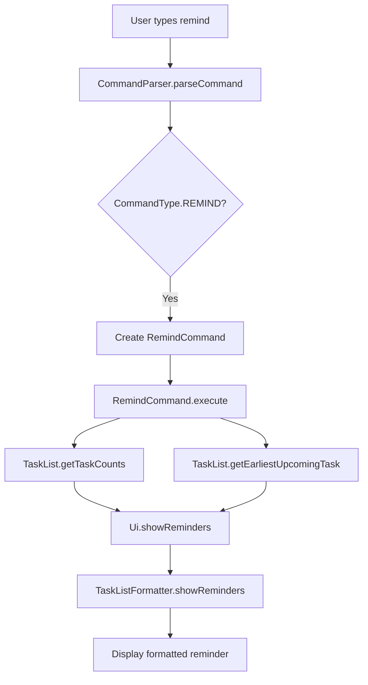

# Reminder Feature Design Document

## 1. Feature Overview

The reminder feature provides users with a summary of their task list and highlights the earliest upcoming task. This feature maintains Monday's grumpy, sarcastic personality while being reluctantly helpful.

### Core Functionality
- Display task counts by type (ToDo, Deadline, Event) and completion status
- Identify and highlight the earliest upcoming uncompleted task (Deadline or Event)
- Show a grumpy summary message reflecting Monday's personality

### User Experience
Users type `remind` (or `reminders`) to see:
1. A sarcastic summary of their task situation
2. Counts of tasks by type and status
3. Details of the earliest upcoming task (if any)

---

## 2. Command Design

### 2.1 Command Type

**Primary Command**: `remind`

**Aliases**: `reminders` (plural form for convenience)

**CommandType Enum Entry**:
```java
REMIND("remind", "reminders")
```

### 2.2 Command Syntax

```
remind
reminders
```

**No arguments required** - The command operates on the entire task list.

### 2.3 Case Insensitivity
Like all Monday commands, `remind` is case-insensitive:
- `remind` ✓
- `REMIND` ✓
- `Remind` ✓
- `reminders` ✓
- `REMINDERS` ✓

---

## 3. Message Design

### 3.1 Message Constants to Add

Add the following constants to [`MessageConstants.java`](../src/main/java/monday/constants/MessageConstants.java):

```java
// ========== Reminder Messages ==========

/** Reminder header message */
public static final String REMIND_HEADER = "Ugh. Fine. Here's your reality check:\n";

/** Reminder message when no tasks exist */
public static final String REMIND_NO_TASKS = "Skeptical. You have absolutely nothing to do. Impressive.";

/** Reminder message when all tasks are completed */
public static final String REMIND_ALL_DONE = "Ugh. Everything is done. Don't get used to it.";

/** Reminder message prefix for task counts */
public static final String REMIND_COUNTS_PREFIX = "You have ";

/** Reminder message suffix for task counts (singular) */
public static final String REMIND_COUNTS_SINGULAR = " task total. ";

/** Reminder message suffix for task counts (plural) */
public static final String REMIND_COUNTS_PLURAL = " tasks total. ";

/** Reminder message for completed count */
public static final String REMIND_COMPLETED_COUNT = "Done: ";

/** Reminder message for pending count */
public static final String REMIND_PENDING_COUNT = "Pending: ";

/** Reminder message for ToDo count */
public static final String REMIND_TODO_COUNT = "ToDos: ";

/** Reminder message for Deadline count */
public static final String REMIND_DEADLINE_COUNT = "Deadlines: ";

/** Reminder message for Event count */
public static final String REMIND_EVENT_COUNT = "Events: ";

/** Reminder message for no upcoming tasks */
public static final String REMIND_NO_UPCOMING = "Nothing coming up. Enjoy the void.";

/** Reminder message for earliest upcoming task prefix */
public static final String REMIND_UPCOMING_PREFIX = "Earliest upcoming: ";

/** Reminder message for overdue task prefix */
public static final String REMIND_OVERDUE_PREFIX = "OVERDUE: ";

/** Reminder message for task due soon (within 24 hours) */
public static final String REMIND_DUE_SOON = " (due soon)";

/** Reminder message for task due today */
public static final String REMIND_DUE_TODAY = " (today)";

/** Help message for remind command */
public static final String HELP_REMIND = "  remind / reminders            - Show task summary and upcoming tasks\n";
```

### 3.2 Message Format Examples

#### Example 1: No Tasks
```
Ugh. Fine. Here's your reality check:
Skeptical. You have absolutely nothing to do. Impressive.
```

#### Example 2: All Tasks Completed
```
Ugh. Fine. Here's your reality check:
You have 3 tasks total. Done: 3. Pending: 0.
ToDos: 1. Deadlines: 1. Events: 1.
Ugh. Everything is done. Don't get used to it.
```

#### Example 3: Tasks with Upcoming Deadline
```
Ugh. Fine. Here's your reality check:
You have 5 tasks total. Done: 2. Pending: 3.
ToDos: 2. Deadlines: 2. Events: 1.
Earliest upcoming: [D][ ] Submit report (by: Feb 20 2026 1800)
```

#### Example 4: Tasks with Overdue Item
```
Ugh. Fine. Here's your reality check:
You have 4 tasks total. Done: 1. Pending: 3.
ToDos: 1. Deadlines: 2. Events: 1.
OVERDUE: [D][ ] Pay bills (by: Feb 18 2026 1200)
```

#### Example 5: Tasks with Event Coming Up
```
Ugh. Fine. Here's your reality check:
You have 3 tasks total. Done: 0. Pending: 3.
ToDos: 1. Deadlines: 1. Events: 1.
Earliest upcoming: [E][ ] Team meeting (from: Feb 19 2026 1400 to: Feb 19 2026 1600)
```

---

## 4. Integration Points

### 4.1 Files to Create

| File | Purpose |
|------|---------|
| `src/main/java/monday/command/RemindCommand.java` | Command implementation |
| `src/test/java/monday/command/RemindCommandTest.java` | Unit tests |

### 4.2 Files to Modify

| File | Modifications |
|------|---------------|
| [`CommandType.java`](../src/main/java/monday/command/CommandType.java) | Add `REMIND` enum entry |
| [`CommandParser.java`](../src/main/java/monday/parser/CommandParser.java) | Add case for `REMIND` in switch statement |
| [`MessageConstants.java`](../src/main/java/monday/constants/MessageConstants.java) | Add reminder message constants |
| [`Ui.java`](../src/main/java/monday/ui/Ui.java) | Add `showReminders()` method |
| [`TaskListFormatter.java`](../src/main/java/monday/ui/TaskListFormatter.java) | Add `showReminders()` method |
| [`ResponseBuilder.java`](../src/main/java/monday/ui/ResponseBuilder.java) | Update `showHelp()` to include remind command |
| [`TaskList.java`](../src/main/java/monday/task/TaskList.java) | Add `getEarliestUpcomingTask()` method |

### 4.3 Integration Flow



---

## 5. Algorithm/Logic

### 5.1 Task Counting Algorithm

**Method**: `TaskList.getTaskCounts()` returns a `TaskCounts` object with:
- Total count
- Completed count
- Pending count
- ToDo count
- Deadline count
- Event count

```java
public TaskCounts getTaskCounts() {
    int total = tasks.size();
    int completed = (int) tasks.stream().filter(Task::isDone).count();
    int pending = total - completed;
    int todos = (int) tasks.stream().filter(t -> t instanceof ToDo).count();
    int deadlines = (int) tasks.stream().filter(t -> t instanceof Deadline).count();
    int events = (int) tasks.stream().filter(t -> t instanceof Event).count();
    return new TaskCounts(total, completed, pending, todos, deadlines, events);
}
```

### 5.2 Earliest Upcoming Task Algorithm

**Method**: `TaskList.getEarliestUpcomingTask()` returns the earliest uncompleted Deadline or Event.

**Logic**:
1. Filter tasks to include only uncompleted Deadlines and Events
2. For each task, determine its "upcoming time":
   - Deadline: Use `by` date/time
   - Event: Use `from` date/time
3. Sort by upcoming time (earliest first)
4. Return the first task, or `null` if no upcoming tasks

```java
public Task getEarliestUpcomingTask() {
    return tasks.stream()
        .filter(task -> !task.isDone())
        .filter(task -> task instanceof Deadline || task instanceof Event)
        .min((t1, t2) -> {
            LocalDateTime time1 = getUpcomingTime(t1);
            LocalDateTime time2 = getUpcomingTime(t2);
            return time1.compareTo(time2);
        })
        .orElse(null);
}

private LocalDateTime getUpcomingTime(Task task) {
    if (task instanceof Deadline) {
        return ((Deadline) task).getByDateTime();
    } else if (task instanceof Event) {
        return ((Event) task).getFromDateTime();
    }
    return LocalDateTime.MAX;
}
```

### 5.3 Task Urgency Classification

Based on current time, classify tasks as:
- **Overdue**: Task date/time is before current time
- **Due Today**: Task date is today
- **Due Soon**: Task is within 24 hours
- **Upcoming**: Task is more than 24 hours away

```java
private UrgencyLevel getUrgencyLevel(Task task, LocalDateTime taskTime) {
    LocalDateTime now = LocalDateTime.now();
    if (taskTime.isBefore(now)) {
        return UrgencyLevel.OVERDUE;
    } else if (taskTime.toLocalDate().equals(now.toLocalDate())) {
        return UrgencyLevel.TODAY;
    } else if (taskTime.isBefore(now.plusHours(24))) {
        return UrgencyLevel.SOON;
    } else {
        return UrgencyLevel.UPCOMING;
    }
}
```

### 5.4 Edge Cases to Handle

| Edge Case | Handling |
|-----------|----------|
| Empty task list | Display "Skeptical. You have absolutely nothing to do. Impressive." |
| All tasks completed | Display "Ugh. Everything is done. Don't get used to it." |
| No upcoming tasks (only ToDos) | Display "Nothing coming up. Enjoy the void." |
| Multiple tasks at same time | Show the one that appears first in the list |
| Overdue task exists | Highlight with "OVERDUE:" prefix instead of "Earliest upcoming:" |

---

## 6. Class Design

### 6.1 RemindCommand Class

```java
package monday.command;

import monday.storage.Storage;
import monday.task.Task;
import monday.task.TaskList;
import monday.ui.Ui;

/**
 * Command to show task summary and upcoming tasks.
 * Displays task counts and the earliest upcoming uncompleted task.
 */
public class RemindCommand extends Command {

    /**
     * Executes the remind command.
     * Displays task summary and earliest upcoming task.
     *
     * @param taskList The task list to analyze.
     * @param ui The UI for displaying messages.
     * @param storage The storage (not used).
     * @return A command result indicating no save or exit needed.
     */
    @Override
    public CommandResult execute(TaskList taskList, Ui ui, Storage storage) {
        assert taskList != null : "TaskList should not be null";
        assert ui != null : "Ui should not be null";
        assert storage != null : "Storage should not be null";

        TaskCounts counts = taskList.getTaskCounts();
        Task earliestTask = taskList.getEarliestUpcomingTask();

        ui.showReminders(counts, earliestTask);
        return new CommandResult(false, false);
    }
}
```

### 6.2 TaskCounts Class (New Helper Class)

```java
package monday.task;

/**
 * Represents counts of tasks by type and status.
 */
public class TaskCounts {
    private final int total;
    private final int completed;
    private final int pending;
    private final int todos;
    private final int deadlines;
    private final int events;

    public TaskCounts(int total, int completed, int pending, int todos, int deadlines, int events) {
        this.total = total;
        this.completed = completed;
        this.pending = pending;
        this.todos = todos;
        this.deadlines = deadlines;
        this.events = events;
    }

    // Getters for all fields
    public int getTotal() { return total; }
    public int getCompleted() { return completed; }
    public int getPending() { return pending; }
    public int getTodos() { return todos; }
    public int getDeadlines() { return deadlines; }
    public int getEvents() { return events; }
}
```

### 6.3 UrgencyLevel Enum (New Helper Enum)

```java
package monday.task;

/**
 * Represents the urgency level of a task.
 */
public enum UrgencyLevel {
    OVERDUE,    // Task is past due
    TODAY,      // Task is due today
    SOON,       // Task is due within 24 hours
    UPCOMING    // Task is more than 24 hours away
}
```

---

## 7. UI Implementation

### 7.1 Ui.showReminders() Method

```java
/**
 * Displays task summary and upcoming tasks.
 *
 * @param counts The task counts.
 * @param earliestTask The earliest upcoming task (may be null).
 */
public void showReminders(TaskCounts counts, Task earliestTask) {
    taskListFormatter.showReminders(counts, earliestTask);
}
```

### 7.2 TaskListFormatter.showReminders() Method

```java
/**
 * Displays task summary and upcoming tasks.
 *
 * @param counts The task counts.
 * @param earliestTask The earliest upcoming task (may be null).
 */
public void showReminders(TaskCounts counts, Task earliestTask) {
    StringBuilder sb = new StringBuilder();

    // Header
    sb.append(MessageConstants.REMIND_HEADER);

    // Handle empty task list
    if (counts.getTotal() == 0) {
        sb.append(MessageConstants.REMIND_NO_TASKS);
        messageFormatter.showResponse(sb.toString());
        return;
    }

    // Task counts
    sb.append(MessageConstants.REMIND_COUNTS_PREFIX);
    sb.append(counts.getTotal());
    sb.append(counts.getTotal() == 1
        ? MessageConstants.REMIND_COUNTS_SINGULAR
        : MessageConstants.REMIND_COUNTS_PLURAL);

    // Status counts
    sb.append(MessageConstants.REMIND_COMPLETED_COUNT);
    sb.append(counts.getCompleted());
    sb.append(". ");
    sb.append(MessageConstants.REMIND_PENDING_COUNT);
    sb.append(counts.getPending());
    sb.append(".\n");

    // Type counts
    sb.append(MessageConstants.REMIND_TODO_COUNT);
    sb.append(counts.getTodos());
    sb.append(". ");
    sb.append(MessageConstants.REMIND_DEADLINE_COUNT);
    sb.append(counts.getDeadlines());
    sb.append(". ");
    sb.append(MessageConstants.REMIND_EVENT_COUNT);
    sb.append(counts.getEvents());
    sb.append(".\n");

    // Handle all tasks completed
    if (counts.getPending() == 0) {
        sb.append(MessageConstants.REMIND_ALL_DONE);
        messageFormatter.showResponse(sb.toString());
        return;
    }

    // Handle no upcoming tasks
    if (earliestTask == null) {
        sb.append(MessageConstants.REMIND_NO_UPCOMING);
        messageFormatter.showResponse(sb.toString());
        return;
    }

    // Display upcoming task with urgency indicator
    LocalDateTime taskTime = getTaskTime(earliestTask);
    UrgencyLevel urgency = getUrgencyLevel(earliestTask, taskTime);

    switch (urgency) {
        case OVERDUE:
            sb.append(MessageConstants.REMIND_OVERDUE_PREFIX);
            break;
        default:
            sb.append(MessageConstants.REMIND_UPCOMING_PREFIX);
            break;
    }

    sb.append(earliestTask.toString());

    // Add urgency suffix for today/soon
    if (urgency == UrgencyLevel.TODAY) {
        sb.append(MessageConstants.REMIND_DUE_TODAY);
    } else if (urgency == UrgencyLevel.SOON) {
        sb.append(MessageConstants.REMIND_DUE_SOON);
    }

    messageFormatter.showResponse(sb.toString());
}

private LocalDateTime getTaskTime(Task task) {
    if (task instanceof Deadline) {
        return ((Deadline) task).getByDateTime();
    } else if (task instanceof Event) {
        return ((Event) task).getFromDateTime();
    }
    return LocalDateTime.MAX;
}

private UrgencyLevel getUrgencyLevel(Task task, LocalDateTime taskTime) {
    LocalDateTime now = LocalDateTime.now();
    if (taskTime.isBefore(now)) {
        return UrgencyLevel.OVERDUE;
    } else if (taskTime.toLocalDate().equals(now.toLocalDate())) {
        return UrgencyLevel.TODAY;
    } else if (taskTime.isBefore(now.plusHours(24))) {
        return UrgencyLevel.SOON;
    } else {
        return UrgencyLevel.UPCOMING;
    }
}
```

---

## 8. Testing Considerations

### 8.1 Unit Tests for RemindCommand

| Test Case | Description |
|-----------|-------------|
| `execute_emptyTaskList` | Verify correct message when no tasks exist |
| `execute_allTasksCompleted` | Verify correct message when all tasks done |
| `execute_onlyToDos` | Verify message when only ToDos exist (no upcoming) |
| `execute_upcomingDeadline` | Verify message with earliest deadline |
| `execute_upcomingEvent` | Verify message with earliest event |
| `execute_overdueTask` | Verify OVERDUE prefix for past-due task |
| `execute_multipleTasksSameTime` | Verify deterministic behavior |
| `execute_dueToday` | Verify "today" suffix for today's tasks |
| `execute_dueSoon` | Verify "due soon" suffix for <24h tasks |

### 8.2 Unit Tests for TaskList.getTaskCounts()

| Test Case | Description |
|-----------|-------------|
| `getTaskCounts_emptyList` | All counts are zero |
| `getTaskCounts_mixedTasks` | Correct counts for each type |
| `getTaskCounts_allCompleted` | Pending is zero |
| `getTaskCounts_allPending` | Completed is zero |

### 8.3 Unit Tests for TaskList.getEarliestUpcomingTask()

| Test Case | Description |
|-----------|-------------|
| `getEarliestUpcomingTask_emptyList` | Returns null |
| `getEarliestUpcomingTask_allCompleted` | Returns null |
| `getEarliestUpcomingTask_onlyToDos` | Returns null |
| `getEarliestUpcomingTask_singleDeadline` | Returns that deadline |
| `getEarliestUpcomingTask_singleEvent` | Returns that event |
| `getEarliestUpcomingTask_multipleTasks` | Returns earliest |
| `getEarliestUpcomingTask_overdueExists` | Returns overdue task |
| `getEarliestUpcomingTask_sameTime` | Returns first in list |

### 8.4 Integration Tests

| Test Case | Description |
|-----------|-------------|
| `remindCommand_integration` | End-to-end reminder display |
| `remindCommand_withParser` | Verify parser creates RemindCommand |
| `remindCommand_caseInsensitivity` | Verify "remind" and "reminders" work |

### 8.5 Test Naming Convention

Follow the existing pattern: `featureUnderTest_testScenario_expectedBehavior()`

Examples:
- `execute_emptyTaskList_displaysNoTasksMessage()`
- `execute_upcomingDeadline_displaysEarliestTask()`
- `getEarliestUpcomingTask_overdueExists_returnsOverdueTask()`

---

## 9. Implementation Checklist

### 9.1 Code Changes

- [ ] Add `REMIND` to [`CommandType.java`](../src/main/java/monday/command/CommandType.java)
- [ ] Add `REMIND` case to [`CommandParser.java`](../src/main/java/monday/parser/CommandParser.java)
- [ ] Add reminder messages to [`MessageConstants.java`](../src/main/java/monday/constants/MessageConstants.java)
- [ ] Create `RemindCommand.java`
- [ ] Create `TaskCounts.java` helper class
- [ ] Create `UrgencyLevel.java` enum
- [ ] Add `getTaskCounts()` to [`TaskList.java`](../src/main/java/monday/task/TaskList.java)
- [ ] Add `getEarliestUpcomingTask()` to [`TaskList.java`](../src/main/java/monday/task/TaskList.java)
- [ ] Add `showReminders()` to [`Ui.java`](../src/main/java/monday/ui/Ui.java)
- [ ] Add `showReminders()` to [`TaskListFormatter.java`](../src/main/java/monday/ui/TaskListFormatter.java)
- [ ] Update `showHelp()` in [`ResponseBuilder.java`](../src/main/java/monday/ui/ResponseBuilder.java)

### 9.2 Test Files

- [ ] Create `RemindCommandTest.java`
- [ ] Add tests to `TaskListTest.java` for new methods
- [ ] Add tests to `CommandTypeTest.java` for REMIND command

---

## 10. Design Decisions Summary

### 10.1 Why This Design?

1. **Command Name**: `remind` is short, intuitive, and follows existing patterns (single word, lowercase)
2. **No Arguments**: Simplifies the UX - users just want a quick summary without complexity
3. **TaskCounts Object**: Encapsulates count data cleanly, avoiding multiple return values
4. **UrgencyLevel Enum**: Makes urgency classification explicit and testable
5. **Earliest Task Focus**: Addresses user requirement to highlight the most urgent task
6. **Grumpy Messages**: Maintains consistency with Monday's personality throughout

### 10.2 Alternatives Considered

| Alternative | Reason for Rejection |
|-------------|---------------------|
| `remind /within 7d` | Too complex for basic summary feature |
| `remind /type deadline` | Overcomplicates simple use case |
| Separate `remind` and `summary` commands | Redundant - single command covers both needs |
| Auto-show reminders on startup | Intrusive - user should control when to see |

### 10.3 Future Enhancements (Out of Scope)

- Allow filtering reminders by task type
- Support custom time windows (e.g., `remind /within 3d`)
- Add reminder notifications for overdue tasks
- Support multiple upcoming tasks display
- Add reminder snooze functionality

---

## 11. Architecture Compliance

### 11.1 Follows Existing Patterns

| Pattern | Compliance |
|---------|------------|
| Command Pattern | ✓ Extends `Command`, returns `CommandResult` |
| Message Constants | ✓ Uses `MessageConstants` for all messages |
| TaskList Operations | ✓ Adds methods following existing naming |
| UI Delegation | ✓ `Ui` delegates to `TaskListFormatter` |
| Case Insensitivity | ✓ Command matching via `CommandType.matches()` |
| Import Ordering | ✓ Project imports before standard imports |

### 11.2 Monday Personality

All messages maintain the grumpy, sarcastic tone:
- "Ugh. Fine. Here's your reality check"
- "Skeptical. You have absolutely nothing to do. Impressive."
- "Ugh. Everything is done. Don't get used to it."
- "Nothing coming up. Enjoy the void."

---

## 12. Appendix: Example Usage

### 12.1 Command Examples

```
# Basic reminder
User: remind
Monday: Ugh. Fine. Here's your reality check:
        You have 5 tasks total. Done: 2. Pending: 3.
        ToDos: 2. Deadlines: 2. Events: 1.
        Earliest upcoming: [D][ ] Submit report (by: Feb 20 2026 1800)

# Using alias
User: reminders
Monday: (same output as above)

# Case insensitive
User: REMIND
Monday: (same output as above)

# Empty task list
User: remind
Monday: Ugh. Fine. Here's your reality check:
        Skeptical. You have absolutely nothing to do. Impressive.
```

### 12.2 Help Integration

```
User: help
Monday: Ugh. Fine. Here's what I understand (not that you'll listen):
        todo <description>           - Add a todo task
        deadline <desc> /by <time>   - Add a deadline task
        event <desc> /from <start> /to <end> - Add an event
        list                         - Show all tasks
        find <keyword>               - Find tasks by keyword
        view <date>                  - Show tasks for a specific date (yyyy-MM-dd)
        mark <number>                - Mark task as done
        unmark <number>              - Mark task as not done
        delete <number>              - Delete a task (no going back)
        cheer                        - Get "motivated" (you'll need it)
        remind / reminders            - Show task summary and upcoming tasks
        help                         - Show this help (you're welcome)
        bye / exit                   - Get rid of me
```
